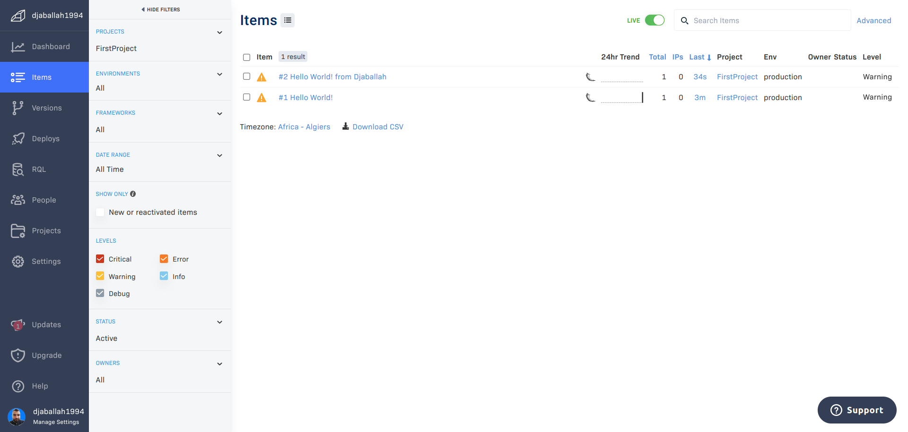

# Week 2 — Distributed Tracing

## Instrument Honeycomb with OTEL

In this challenge, I was able to implement honeycomb instrumentation to the backend-flask service.
</br>
See: [commit](https://github.com/djaballah/aws-bootcamp-cruddur-2023/commit/0ded95d137c990ee427fb5968acbfa81828d39a8)


## Create a custom honeycomb span for the home/activities endpoint.

In this challenge, I create a cusomt honeycomb spand with custom attributes in the home/activities endpoint.
</br>
See: [commit](https://github.com/djaballah/aws-bootcamp-cruddur-2023/commit/2ab3196061bba334c644fee2858cedbed5f0fb1c)


## Instrument AWS X-Ray
In this challenge I implemented X-ray instrumentation.
</br>
See: [commit](https://github.com/djaballah/aws-bootcamp-cruddur-2023/commit/817fcfacced0903bf8ca05c1a0d3f4c02f2f756d)


## Implement an X-ray custom segment for the user activities endpoint
In this challenge I implemented a custom segment with the attirbute `now` for the user activities endpoint.
</br>
See: [commit](https://github.com/djaballah/aws-bootcamp-cruddur-2023/commit/5ad6ced39348975629b3cc29f195dbcfc23735c8)


## Configure custom logger to send to CloudWatch Logs
In this challenge, I implemented a custom logger to send logs to cloudwatch logs.
</br>
See: [commit](https://github.com/djaballah/aws-bootcamp-cruddur-2023/commit/005c7326d93dfda780b90f0d5228a7abf783c1cd)


## Integrate Rollbar and capture errors
In this challenge, I intergrated rollbar to capture and log errors.
</br>
See: [commit](https://github.com/djaballah/aws-bootcamp-cruddur-2023/commit/7ebfb4744432f66159798582dc1568f8df7e3fb8)



## Instrument Honeycomb for the frontend service
In order to imlplement Honeycomb instrumentation for the frontend, we need to implement a custom honeycomb proxy in
the backend service to collect traces from the frontend.
1. First, we need to install the python package `requests` that will be used to make `POST` request to the honeycomb traces endpoint, so in the `requirements.txt` file add this
   ```
   requests
   ```
2. In order to make requests to the Honeycomb traces endpoint, we need the Honeycomp API tokend and the endpoint, those are going to be configured in the backend service in the docker-compose file.

   ```
   HONEYCOMB_API_KEY: "${HONEYCOMB_API_KEY}"
   HONEYCOMB_TRACES_API: "https://api.honeycomb.io/v1/traces"
   ```

3. In the backend-flask service, we will implement an endpoint with the path `/honeycomb/traces` that will receive spans from the frontend service.

    1. First we need to import the requests package

        ```python
        import requests
        ```
    2. Then we need to implement the endpoint the receives the spans from the frontend then send it to the Honeycomb
       traces api.

       ```python
       @app.route("/honeycomb/traces", methods=['POST','OPTIONS'])
       @cross_origin(supports_credentials=True)
       def collect_traces():
         otlp_json_exported_from_frontend = request.json
         headers = {
           'Content-Type': 'application/json',
           'x-honeycomb-team': os.getenv('HONEYCOMB_API_KEY'),
         }

         response = requests.post(
           url=os.getenv('HONEYCOMB_TRACES_API'),
           json=otlp_json_exported_from_frontend,
           headers=headers
         ) 

       return {'success': True}, 200
       ```

After implementing, the Honeycomb proxy in the backend, now we need to instrument the frontend and send traces to our proxy.
1. First we need to install those packages

    ```bash
    npm install --save \
      @opentelemetry/api \
      @opentelemetry/sdk-trace-web \
      @opentelemetry/exporter-trace-otlp-http \
      @opentelemetry/context-zone
    ```
2. we need to create a file to configure honeycomb so it send traces to the backend proxy. we will create a file named `tracing.js` inside `frontend-react-js/src/tracing`.
    ```javascript

    import { OTLPTraceExporter } from '@opentelemetry/exporter-trace-otlp-http';
    import { WebTracerProvider, BatchSpanProcessor } from '@opentelemetry/sdk-trace-web';
    import { ZoneContextManager } from '@opentelemetry/context-zone';
    import { Resource }  from '@opentelemetry/resources';
    import { SemanticResourceAttributes } from '@opentelemetry/semantic-conventions';
    import process from 'process';
    
    // Configure the open telemetry trace exporter to send traces to the backend proxy.
    const exporter = new OTLPTraceExporter({
      url: `${process.env.REACT_APP_BACKEND_URL}/honeycomb/traces`,
    });

    // Configure the open telemetry web trace provider, and set the service name to `fronted-react-js`
    const provider = new WebTracerProvider({
      resource: new Resource({
        [SemanticResourceAttributes.SERVICE_NAME]: 'fronted-react-js',
      }),
    });

    provider.addSpanProcessor(new BatchSpanProcessor(exporter));

    provider.register({
      contextManager: new ZoneContextManager()
    });

    ```
3. The file `tracing.js` needs to be imported in the frontend app entry point, so we are going to import it in `frontend-react-js/src/index.js`
    ```
    import './tracing/tracing'
    ```
4. Implement a custom trace in the Home feed page

    1. First we need to import `trace, context` from the `opentelemetry/api`.
        ```
        import { trace, context, } from '@opentelemetry/api';
        ```
    2. We need to instantiate a tracer in the HomeFeedPage function
        ```
        const tracer = trace.getTracer();
        ```
    3. In the function that's initializing the view and fetching the data from the api, we will create multiple spans, a root span named `HomeFeedPage` that represent initializing the Home Feed Page, and two sub spans, one to represent fetching the home activities data from the backend (the `load_data` spans), and the other to represent the authentication check (the `check_auth` span).
        ```
        React.useEffect(()=>{
          //prevents double call
          if (dataFetchedRef.current) return;
          dataFetchedRef.current = true;

          tracer.startActiveSpan('HomeFeedPage', (span) => {
            tracer.startActiveSpan('load_data', (span) => {
              span.setAttribute('endpoint', '/api/activities/home');
              loadData();
              span.end()
            })
            tracer.startActiveSpan('check_auth', (span) => {
              span.setAttribute('endpoint', '/api/auth');
              checkAuth();
              span.end()
            })
            span.end()
          })
        }, [])
        ```
See:
- [commit 1](https://github.com/djaballah/aws-bootcamp-cruddur-2023/commit/0a9a64cb7f76d182e5a6563413cb3c71396cc78f)
- [commit 2](https://github.com/djaballah/aws-bootcamp-cruddur-2023/commit/0112d4cd7984099315dbddd4b13d0db6d5ea8702)


## Create a custom Honeycomb graph query

In this challenge I created a query to get the most requested endpoints

